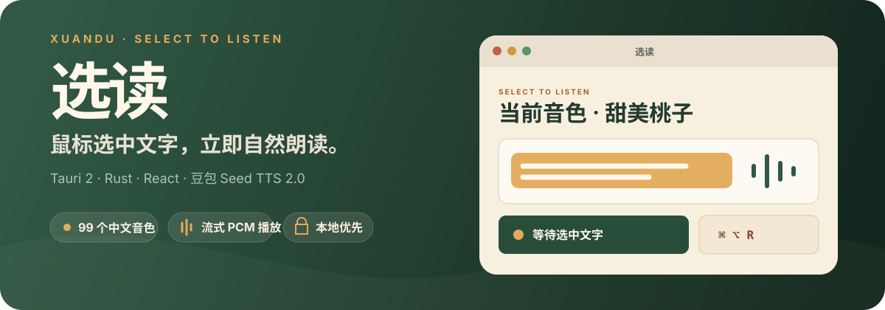
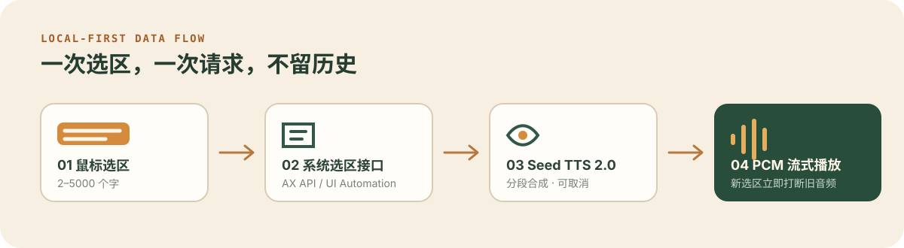

<p align="center">
  
</p>

<p align="center">
  <strong>托盘常驻</strong> · <strong>99 个内置中文音色</strong> · <strong>长文本分段</strong> · <strong>新选区立即打断</strong> · <strong>本地优先</strong>
</p>

<p align="center">
  <a href="#快速开始">快速开始</a> ·
  <a href="#它如何工作">它如何工作</a> ·
  <a href="#隐私与安全">隐私与安全</a> ·
  <a href="./PRODUCT_ROADMAP.md">产品路线</a>
</p>

## 把阅读变成听读

选读是一款 Tauri 2 桌面工具。开启朗读模式后，在支持辅助功能的应用中用鼠标选中文字，它会调用火山引擎豆包 Seed TTS 2.0 进行合成，并边接收边播放。

日常使用时不需要打开设置窗口：通过全局快捷键或系统托盘就能开启、关闭和停止朗读。

| 体验 | 当前行为 |
| --- | --- |
| 选中即读 | 鼠标释放后约 150 ms 读取选区，清理首尾空白后朗读 |
| 最新优先 | 新选区会取消当前请求并立即停止旧音频 |
| 长文本 | 支持 2–5000 个字，按句子边界分段合成，PCM 队列不丢弃后续样本 |
| 音色目录 | 内置 99 个中文 Seed TTS 2.0 音色，支持搜索、筛选、收藏和独立试听 |
| 稳定声音调节 | 语速、音量与 -12 到 +12 半音的音调可独立调整，适合需要可重现的表达控制 |
| 语音指令（实验） | 可使用预设或自定义文本影响表达倾向；它是模型软提示，效果会受文本语义、标点和音色风格影响，仅官方 2.0 音色支持 |
| 快捷键 | macOS 默认 `⌘⌥R`，Windows 默认 `Ctrl+Alt+R`；支持按键录制、冲突检查与失败回滚 |
| 桌面常驻 | 关闭设置窗口只会隐藏到托盘，“退出”才会结束进程 |

## 它如何工作

<p align="center">
  
</p>

应用内部保持三个明确边界：

- `SelectionProvider`：macOS 使用 Accessibility API，Windows 使用 UI Automation `TextPattern` 读取当前选区。
- `TtsClient`：分段构造豆包 TTS v3 请求，解析流式响应并支持取消。
- `PlaybackController`：在独立音频线程中管理有界 PCM 队列，保证长音频顺序和“最新请求覆盖旧请求”。

## 快速开始

### 1. 准备语音服务

在火山引擎控制台开通可使用 `seed-tts-2.0` 的 API Key。调用产生的费用由你的火山引擎账号承担。

### 2. 从源码启动

需要 Node.js 20+、Rust stable 和当前平台的原生构建工具。

```bash
npm install
npm run tauri dev
```

### 3. 完成首次配置

1. 在“高级”中保存 API Key。Key 只会写入 macOS Keychain 或 Windows Credential Manager。
2. 在“音色”中选择并试听一个官方中文音色。
   优先用语速、音量和音调获得稳定可重现的效果。如需进一步影响情感倾向，再展开“语音指令”进行 A/B 试听。
3. macOS 在“系统设置 → 隐私与安全性 → 辅助功能”中允许“选读”。
4. 按全局快捷键，状态变为“等待选中文字”后开始使用。

## 构建与验证

```bash
# 前端类型检查与生产构建
npm run build

# 前端单元测试
npm test

# Rust 单元测试
cargo test --manifest-path src-tauri/Cargo.toml
```

macOS Apple Silicon 可用下面的本地打包命令生成 ad-hoc 签名的 `.app` 和 `.dmg`：

```bash
npm run bundle:mac
```

打包脚本为应用写入稳定的 designated requirement，减少本地重新构建后 macOS 将辅助功能授权识别为新应用的情况。

Windows x64 安装包必须在真实 Windows x64 环境中构建和手工验收：

```powershell
npm install
npm exec tauri build -- --bundles msi,nsis
```

## 隐私与安全

- API Key 只保存在系统钥匙串，不写入项目配置、诊断文件或前端状态。
- 选中文字只在内存中用于当次 TTS 请求，不保存原文、不建立历史记录。
- 短时去重仅保留文本哈希，诊断日志只记录状态、错误类型和脱敏配置摘要。
- 无账号系统、无分析埋点、无云端文本历史；文本只发送给用户配置的火山引擎 TTS 服务。

## 平台边界

- macOS：当前在 Apple Silicon 上构建和验证，需要辅助功能权限。
- Windows：面向 x64；未暴露 UI Automation 选区的控件、管理员权限窗口和受保护输入框会被安全跳过。
- 不支持键盘选区监听、OCR、剪贴板降级、朗读历史或长文本队列。
- 当前不包含 Apple 公证、Windows Authenticode 或自动更新。

## 技术栈

- Tauri 2 + Rust
- React 19 + TypeScript + Vite
- macOS Accessibility API / Windows UI Automation
- `reqwest` 流式 HTTP + `cpal` 原生音频输出
- 火山引擎豆包 Seed TTS 2.0

产品稳定性和跨平台待办见 [PRODUCT_ROADMAP.md](./PRODUCT_ROADMAP.md)。
